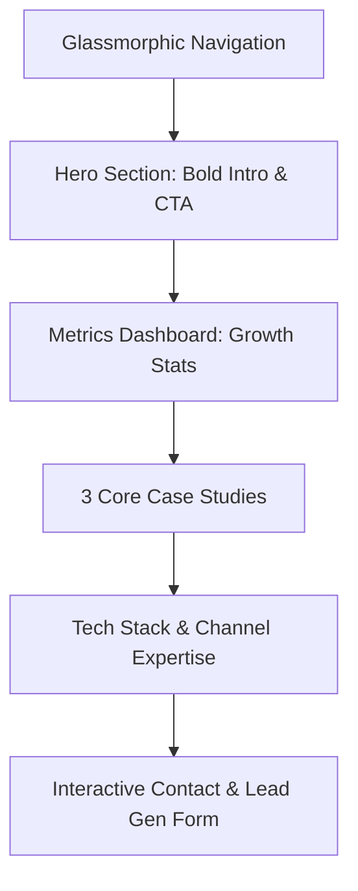

# Plan: Wongsaton (Tee) Pattanantapong's Portfolio Website

This document outlines the detailed build plan for creating a premium, modern performance marketing portfolio website for **Wongsaton (Tee) Pattanantapong**.

---

## 🎨 Design System & Aesthetic

To reflect **Paid Performance Marketing** (data, scale, returns, growth), we will implement a high-end "cyber-finance" dark aesthetic:
* **Background**: Very dark obsidian charcoal (`#0A0A0C` to `#121214`) to give a premium, clean look.
* **Accent Colors**: 
  * **Neon Emerald/Mint Green (`#00F59B` / `#10B981`)**: Represents positive ROI, growth, and performance metrics.
  * **Electric Cobalt/Cyan (`#00D2FF` / `#3B82F6`)**: Represents analytics, data, and technology.
  * **Warm White / Silver (`#F3F4F6` / `#9CA3AF`)**: For readable, contrast-friendly copy.
* **Typography**: Google Font **JetBrains Mono** for all elements, evoking data, code, analytics, and precision.
* **Interactive Elements**: Glassmorphic panels (semi-transparent backdrops with light borders), glowing hover effects, micro-animations on cards, and numeric counter animations.

---

## 🏗️ Website Structure (`index.html`)

The single-page portfolio will contain the following key sections:

### 1. Header (Navbar)
* Fixed position with background blur (`backdrop-filter: blur(12px)`).
* Minimalist branding: `<WP. />` (Wongsaton Pattanantapong).
* Smooth scroll navigation links: `About`, `Projects`, `Skills`, `Contact`.

### 2. Hero Section
* **Title**: Wongsaton (Tee) Pattanantapong
* **Subtitle**: Paid Performance Marketing Specialist
* **Sub-copy**: "Scaling businesses with data-driven paid acquisition, conversion rate optimization (CRO), and growth-focused ad strategies."
* **CTAs**: Primary "Explore Case Studies" button and secondary "Get in Touch" button.
* **Visuals**: Animated background grid and floating glowing spheres.

### 3. Key Metrics (Stats Dashboard)
To establish immediate credibility:
* **Managed Spend**: `$3M+ Managed Ad Budget`
* **Average ROAS**: `3.5x Average Return on Ad Spend`
* **Lead Conversion**: `+45% Conversion Rate Uplift`

### 4. Core Case Studies (3 Projects)
Specifically designed for a Performance Marketing specialist:
1. **Case Study 1: E-commerce ROAS Scale-up ($0 to $1M ARR)**
   * *Description*: Scaled cross-channel ads (Meta + Google Search/PMax) while maintaining a strict 4.0x ROAS threshold.
   * *Keywords*: Meta Ads, PMax, Budget Allocation, LTV Optimization.
2. **Case Study 2: High-Volume Lead Gen Funnel Optimization**
   * *Description*: Redesigned landing pages, implemented custom audience routing, and cut Cost-Per-Lead (CPL) by 42%.
   * *Keywords*: A/B Testing, CRO, TikTok Ads, CRM Integration.
3. **Case Study 3: Custom Marketing Mix Modeling (MMM) Dashboard**
   * *Description*: Designed a multi-touch attribution dashboard to solve iOS 14+ tracking issues and attribute true marketing impact.
   * *Keywords*: GA4, SQL, Looker Studio, Attribution Models.

### 5. Skills & Ad Platform Stack
* Categorized grid of logos and badges (Meta Ads, Google Ads, TikTok Ads, GA4, GTM, SQL, Looker Studio, HubSpot).

### 6. Interactive Contact Section
* Custom glassmorphic contact form (or floating action buttons for email/LinkedIn).
* Styled with input fields that glow neon green when focused.

---

## 🛠️ Technical Implementation Files

We will build the website with three clean files in the root directory:
1. index.html — Structural markup, semantic elements, and SEO tags.
2. style.css — Custom dark-theme styling, glassmorphism, responsive grid, JetBrains Mono font imports, and hover effects.
3. script.js — Scroll animations, statistics counting animation, and simple form validation logic.

---

## 🚀 GitHub Pages Deployment Steps

1. Create a public repository named `wongsaton-tee-portfolio` (or similar) on GitHub.
2. Commit files (`index.html`, `style.css`, `script.js`, and any image assets).
3. Navigate to **Settings > Pages** on the GitHub repository.
4. Select `main` branch, `/ (root)` folder, and click **Save**.
